<html>

<head>
    <meta content="text/html; charset=UTF-8" http-equiv="content-type">
</head>

<body class="c22">
    
Breath Taking

    
An attempt to bootstrap a single speaker
            text-to-speech model

    
Eric Stevens

    <h1 class="c7" id="h.ev5xnxgc0qze">Introduction</h1>
    
The goal of this project is to bootstrap a text-to-speech model when provided a large
            quantity (5 hours) of single speaker audio data. The term bootstrap refers to the fact that only the audio
            data is given. Audio/text pairings for the sequence to sequence training set are created using open source
            speech to text tools. The audio is temporarily compressed in order to make a sequence to sequence model
            feasible.

    <h1 class="c7" id="h.2k8epta579bh">Goals</h1>
    
Due to the complex nature of the task, there is a substantial amount of
            infrastructure and tooling that needed to be built in order to examine the results of trained models.
            Therefore, this paper is not intended as a research paper but rather an exploration of a conceptual model.
        

    

    
This task is something that I feel an entire thesis could be written on. In the
            context of a final project for a first deep learning course, I didn&rsquo;t think that it was reasonable to
            expect that I would get much performance out of this model. What was important to me was to build the
            system, end-to-end. 

    

    
The goal of building a simplistic end-to-end solution has two major outcomes. First,
            it will force me to get familiar with the tools (PyTorch in this case) of deep learning as well as give me
            exposure to working with multiple different models (autoencoders and recurrent neural networks). In other
            words, advancing my own education is the first major outcome of this strategy. 

    

    
The second outcome of focusing on building an overly simplistic end-to-end solution
            is that it will provide the scaffolding from which I can dive deeper into the places where I think the model
            can be improved. Furthermore, taking the rapid prototyping approach to the problem will allow me to evaluate
            if it is reasonable to expect that this model has potential for further success.

    <h1 class="c7" id="h.nmgb3qf4n3t7">Data</h1>
    
The data for this project was extracted from the Harper Audio presentation of Yuval
            Noah Harari&rsquo;s book Homo Deus, read by voice actor Derek Perkins (audio book). Data was recorded from
            one machine to another and used in its raw (.wav) form, other than downsampling it to 16 KHz.

    <h1 class="c7" id="h.yofr7sobu05">Model</h1>
    
The final model is a sequence to sequence recurrent architecture that takes text as
            input and outputs audio in the voice of the speaker. This takes place in two stages. First an autoencoder is
            used for dimensionality reduction of the raw audio data. Once the autoencoder has sufficiently compressed
            the audio data, a sequence to sequence recurrent network is trained on text as the input and the compressed
            audio signal as the target.

    

    
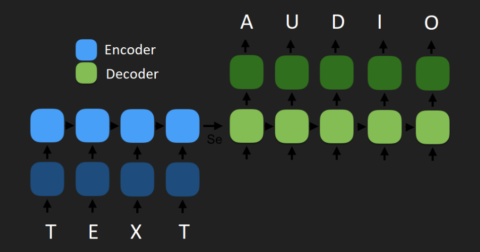

    <h1 class="c7" id="h.t7sx70ngbuld">Autoencoder</h1>
    
The problem with using a sequence to sequence model for text to raw audio is the long
            term dependencies in the raw audio file. While two seconds of spoken words may only be constitute a sequence
            of 5 to 20 characters, the downsampled 16 KHz audio will be a sequence of 32,000 floating point numbers.
            This is far too long of a sequence to leverage an RNN for a solution. 

    

    

    

    
We have a situation where the audio data is more complex in terms of bits per time
            unit, but more importantly that the sequence lengths are very different. To address these concerns an
            approach is taken to compress the audio data in terms of both data size and temporal unit length. 
    

    

    <h2 class="c13" id="h.9u9r4rceq6ro">DFT (Discrete Fourier Transform) for sequence
            compression</h2>
    
Since the biggest concern in the sequence to sequence architecture is the length of
            raw audio output, the DFT is used for chunking the audio data into time steps, resulting in sequences orders
            of magnitude smaller than their raw audio form.

    

    
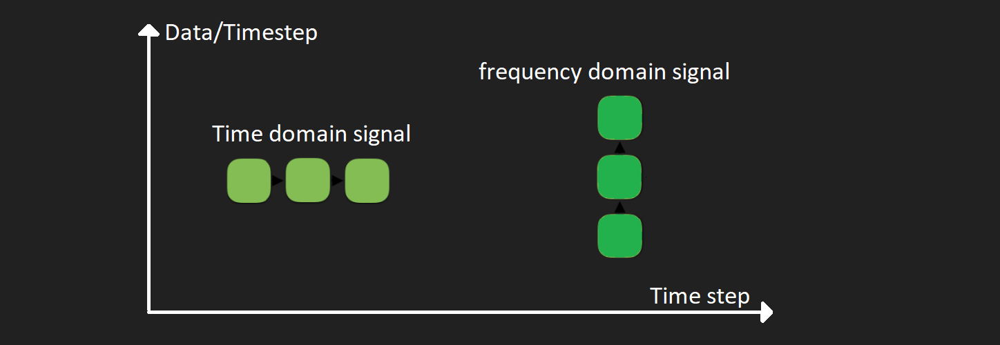

    

    
The DFT will take care of the temporal compression by packing many audio signal
            samples into a single time step in the frequency domain. This, however, does not reduce the complexity of
            the data, just the sequence length. The autoencoder will be used to reduce the dimensionality of the DFT
            chunks.

    

    <h2 class="c13" id="h.may16n3m1zdv">Dimensionality reduction of DFT output using autoencoder
    </h2>
    
Once the audio time series sequence length has been reduced with the DFT, an auto
            encoder is used to reduce the overall data complexity. The output of the DFT actually doubles the data
            complexity of the input signal because for real valued sample that is fed into the DFT algorithm a two
            component complex number is output. In other words, if a .wav audio snippet is fed into the DFT as a
            sequence of 32 bit floating point number, the output is a collection 64 bit complex number. To prepare this
            data for the autoencoder, the real and complex portions are separated and the magnitudes of the separated
            components are concatenated. &nbsp;This concatenated array is what is fed to the autoencoder.

    

    
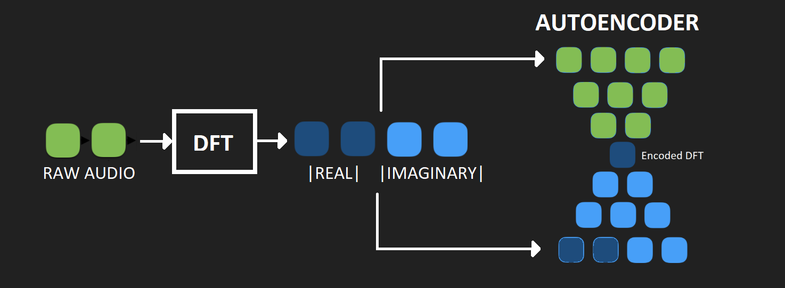

    

    <h2 class="c13" id="h.ukdz4170cdgv">Autoencoder Python Implementation</h2>
    
PyTorch was used for both the input data preprocessing as well as the network
            implementation. Several combinations of models were tried. This section will discuss only the best
            performing model. 

    <h3 class="c15" id="h.hq17s1jh6w5q">Autoencoder data generation and preprocessing</h3>
    
The best performance with respect to the sequence to sequence model ended came from
            an autoencoder that performed temporal compression by a factor of 1,600. In other words, the autoencoder was
            trained on 100 ms chunks of raw audio data converted into the frequency domain representation discussed
            above. 

    

    
The preprocessing for this implementation involved loading the full (several hours
            long) .wav file and randomly sampling 100 ms segments from it. The PyTorch Dataset class was leveraged to do
            this preprocessing.

    
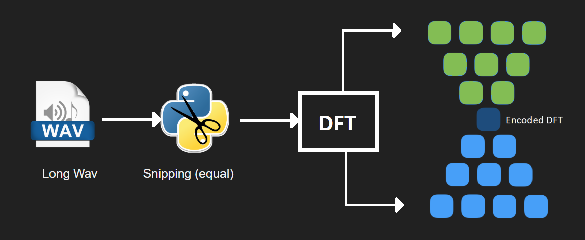

    

    
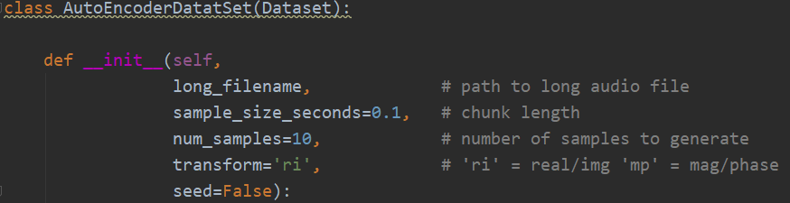

    

    
The constructor for the Dataset class allows the user to choose the length in seconds
            of the audio samples to generate the frequency domain representation from. It also allows the user to choose
            how many samples should be generated. It allows for a few other options but again we will be discussing the
            model that was used in the final implementation.

    

    
The construct then proceeds to use the information handed in by the user to create
            the frequency domain representation of audio. 

    

    
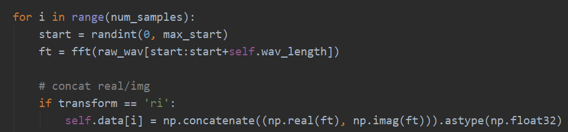

    

    
The full dataset is loaded into RAM at the time the constructor is called so that the
            GPU can be leveraged to its full capacity come training time.

    

    <h3 class="c15" id="h.hfk7ep19wm84">Autoencoder model</h3>
    
A deep but very simple model displayed the best balance of audio reproduction
            performance and GPU utilization. To avoid the potential for vanishing gradients, the ReLU activation
            function was used at all layers except the output layer of the decoder, where a sigmoidal later was used.
        

    

    
The model has an 8 layer encoder and an 8 layer decoder that mirror each other in
            layer size. All layers are fully connected. The code was written to take layer sizes as inputs to the
            constructor so that different layer sizes could easily be tested for model and GUP performance.

    

    
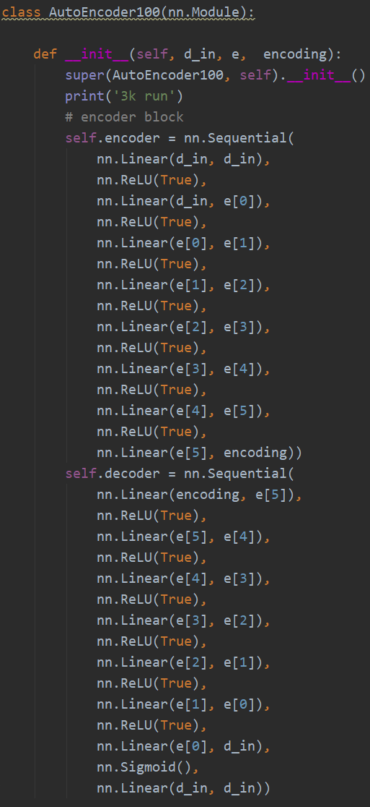

    
The raw audio data is 100 ms sampled at 16 KHz. This means that there are a total of
            1,600 samples being used to take the DFT. The DFT doubles that, making our concatenated input vector an
            input size of 3,200. So &lsquo;d_in&rsquo; = 3200.

    

    
Our first layer is a fully connected layer of the size of the input. Then we continue
            dividing by two until we get close to our target of 32 in our encoding layer. That is Input=3,200, 0=1,600,
            1=800, 2=400, 3=200, 4=100, 5=50, then the size of the encoding layer is 32. These parameters are used to
            mirror the decoder.

    

    <h3 class="c15" id="h.drc5faocis6f">Autoencoder training</h3>
    
Although I was aware of the fact that there are better loss functions, MSE was chosen
            for the sake of simplicity. Adam was chosen as the optimizer. Several learning rates were tried, with 0.0001
            seeming to obtain the best performance on long term training. 

    

    
A PyTorch DataLoader object was used to distribute the data to model on the GPU. This
            allowed the GPU to operate at almost 100 percent compute capacity throughout the training process. 
    

    

    
For the final model, 100,000 100 ms clips were trained on with a batch size of 400
            for 5,000 epochs. Training took about 15 hours.

    

    

    
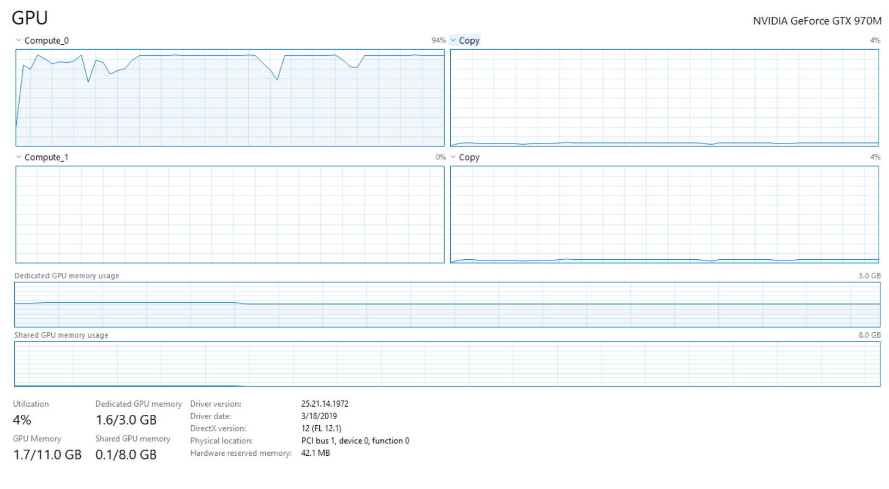

    <h3 class="c15" id="h.u7d8cocwa14z">Autoencoder results</h3>
    
The results of the autoencoder were alright. Not very impressive in terms of clarity,
            but since a fairly unsophisticated model was used I still think the results are impressive. It is important
            to remember the compression ratio for the algorithm is 50/1 since 1,600 32 bit audio samples get converted
            to 32 32 bit encoded DFT values.

    

    
Since the output of the decoder is trained on the concatenated DFT, tooling had to be
            implemented to invert the output back into the time domain and patch the chunks together. Below are links to
            the original data paired with the autoencoder output.

    

    

    <table class="c12">
        <tbody>
            <tr class="c6">
                <td class="c0" colspan="1" rowspan="1">
                    
Original Audio Data

                </td>
                <td class="c0" colspan="1" rowspan="1">
                    
Autoencoder Output

                </td>
            </tr>
            <tr class="c6">
                <td class="c0" colspan="1" rowspan="1">
                    
<a class="c10"
                                href="https://www.google.com/url?q=https://drive.google.com/open?id%3D1hH7E1riMDeWiisUFnk-k4slrnOX3BzUf&amp;sa=D&amp;ust=1583354762613000">in_2_100ms.wav</a>
                    

                </td>
                <td class="c0" colspan="1" rowspan="1">
                    
<a class="c10"
                                href="https://www.google.com/url?q=https://drive.google.com/open?id%3D10JXsB_G6UB4mClBQgZVoAxXiBuf7SwpT&amp;sa=D&amp;ust=1583354762613000">out_2_100ms.wav</a>
                    

                </td>
            </tr>
            <tr class="c6">
                <td class="c0" colspan="1" rowspan="1">
                    
<a class="c10"
                                href="https://www.google.com/url?q=https://drive.google.com/open?id%3D1gIjs4YY3obLf7ZcdujzrdFaWaq3o0Uqi&amp;sa=D&amp;ust=1583354762614000">in_3_100ms.wav</a>
                    

                </td>
                <td class="c0" colspan="1" rowspan="1">
                    
<a class="c10"
                                href="https://www.google.com/url?q=https://drive.google.com/open?id%3D1ybRkfwsmn737s68CePp_h1KKxrX7sQJA&amp;sa=D&amp;ust=1583354762615000">out_3_100ms.wav</a>
                    

                </td>
            </tr>
            <tr class="c6">
                <td class="c0" colspan="1" rowspan="1">
                    
<a class="c10"
                                href="https://www.google.com/url?q=https://drive.google.com/open?id%3D1H2HAHgAuXRxObS_N2cPPCPcS66VsaCVC&amp;sa=D&amp;ust=1583354762616000">in_4_100ms.wav</a>
                    

                </td>
                <td class="c0" colspan="1" rowspan="1">
                    
<a class="c10"
                                href="https://www.google.com/url?q=https://drive.google.com/open?id%3D13_qt1vLVxMxG8H8qTgx_Vr7IV9-eCu2h&amp;sa=D&amp;ust=1583354762617000">out_4_100ms.wav</a>
                    

                </td>
            </tr>
        </tbody>
    </table>
    

    

    

    

    

    

    

    <h1 class="c7" id="h.4ke7xs9o1l42">Text-to-speech RNN</h1>
    
The ultimate goal of this project is to get an end-to-end text to speech model. The
            decision was made to use an encoder/decoder RNN to attempt to accomplish this task. The autoencoder
            discussed in the above section was built to compress audio sequence length by orders of magnitude so that
            the length of the text sequences would be comparable to the length of the audio sequences. With the
            autoencoder working and in-hand, the sequence to sequence model can begin to be built.

    <h2 class="c13" id="h.bav37112p7ht">Text-to-speech RNN data generation</h2>
    
To reiterate, the premise of this project is that we are only armed with a large
            amount of single speaker audio data. We do not have access to any text data. This is where the word
            &lsquo;bootstrap&rsquo; in the subtitle of this paper comes into play. 

    

    
A training set of audio paired with its corresponding text needs to be generated.
            Luckily, there are plenty of open source tools for ASR. In this project the open source Python library
            SpeechRecognition is used to generate the audio/text pairings. Tools were written to randomly slice the
            large audio file into clips between 3 and 10 seconds long. These clips were then fed into the speech
            recognition tool and the resulting text is stored in a .txt file while the audio clip is stored as a .wav
            file sharing the same name.

    

    
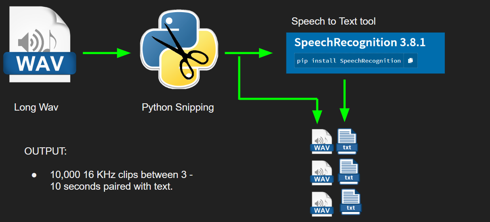

    

    
10 thousand of these pairs were generated as the training set for the text-to-speech model.
            Since the audio slices were taken from random portions of the long audio file, there are clips that start
            out in the middle of words, and the speech recognition system is not perfect in general. The table below
            shows the actual text output generated from the speech recognition model and the audio a link to the audio
            it is paired with. 

    

    

    <table class="c12">
        <tbody>
            <tr class="c6">
                <td class="c0" colspan="1" rowspan="1">
                    
Text

                </td>
                <td class="c0" colspan="1" rowspan="1">
                    
Audio

                </td>
            </tr>
            <tr class="c6">
                <td class="c0" colspan="1" rowspan="1">
                    
scrutiny liberals value individual liberty so much because they believe that
                            humans have free will corn

                </td>
                <td class="c0" colspan="1" rowspan="1">
                    
<a class="c10"
                                href="https://www.google.com/url?q=https://drive.google.com/open?id%3D15578JCheThxn-tJzpHZX0OS1ZpCBfuxS&amp;sa=D&amp;ust=1583354762622000">https://drive.google.com/open?id=15578JCheThxn-tJzpHZX0OS1ZpCBfuxS</a>
                    

                </td>
            </tr>
            <tr class="c6">
                <td class="c0" colspan="1" rowspan="1">
                    
the howl of&nbsp;humankind has used its
                            growing&nbsp;pile up

                </td>
                <td class="c0" colspan="1" rowspan="1">
                    
<a class="c10"
                                href="https://www.google.com/url?q=https://drive.google.com/open?id%3D1EjSAmAEd7ZD71Z6QyPCWmwZO7qSM5-lF&amp;sa=D&amp;ust=1583354762624000">https://drive.google.com/open?id=1EjSAmAEd7ZD71Z6QyPCWmwZO7qSM5-lF</a>
                    

                </td>
            </tr>
            <tr class="c6">
                <td class="c0" colspan="1" rowspan="1">
                    
__&nbsp;the good feelings of the two lovers
                            outweigh the bad feelings of their spouses and children

                </td>
                <td class="c0" colspan="1" rowspan="1">
                    
<a class="c10"
                                href="https://www.google.com/url?q=https://drive.google.com/open?id%3D1cE11-guDXzfSTZZKW2mGgwJHhLolBl9U&amp;sa=D&amp;ust=1583354762625000">https://drive.google.com/open?id=1cE11-guDXzfSTZZKW2mGgwJHhLolBl9U</a>
                    

                </td>
            </tr>
        </tbody>
    </table>
    

    

    <h2 class="c13" id="h.t1k2d1aa9gxo">Leveraging the autoencoder in the RNN</h2>
    
Again, the problem that the autoencoder addresses is the mismatch in sequence length
            between the text and its raw audio format. It does this by compressing the audio data into 100 ms long time
            steps. In order to leverage this the audio data needs to be passed through the encoder block of the
            autoencoder. It is the output of the encoder block that will be the target of the sequence to sequence
            model, not the raw audio data. The image below displays this workflow.

    

    
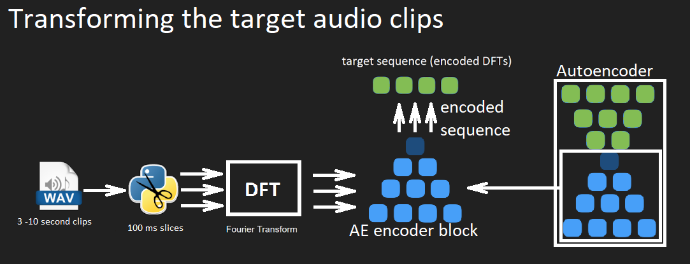

    

    
It is the pairing of the encoded DFT sequences and the text that is the training set.
            The sequence to sequence model will be given text as input and the encoded the encoded DFT sequence as the
            target. Now we have the setup in the following image.

    

    
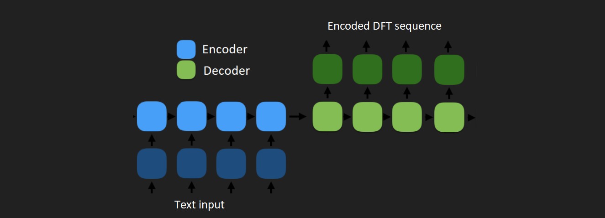

    

    
This is the full setup for the training of the text-to-speech RNN. It is important
            not to get confused. The RNN is also an encoder decoder model. Make sure you understand the difference
            between the autoencoder used to compress the audio data and the encoder/decoder RNN used to train the
            text-to-speech model.

    

    <h2 class="c13" id="h.tryrvfymryb2">Text-to-speech RNN Implementation</h2>
    
The model used for the RNN was adapted from <a class="c10"
                href="https://www.google.com/url?q=https://bentrevett.github.io/about/&amp;sa=D&amp;ust=1583354762627000">Ben
                Travette&rsquo;</a>s implementation of a text-sequence to text-sequence machine translation
            mode that can be found <a class="c10"
                href="https://www.google.com/url?q=https://github.com/bentrevett/pytorch-seq2seq/blob/master/1%2520-%2520Sequence%2520to%2520Sequence%2520Learning%2520with%2520Neural%2520Networks.ipynb&amp;sa=D&amp;ust=1583354762627000">here</a>. It is a multi-layer LSTM architecture. Ben&rsquo;s model is a word token level model that
            includes word embedding layers. Since the outputs in Ben&rsquo;s models are words, he also uses soft max
            output function to generate a probability distribution over his vocabulary.

    

    
Our text-to-speech RNN is a character level model. We strip away the embedding and
            softmax layer and once again make our loss function the MSE. 

    

    
Text-to-speech RNN data loading and preprocessing

    
In a prior section we discussed how the training data set was generated from only the
            audio. We currently have the raw audio paired with the text output of the SpeechRecognition tool. Before the
            data can be trained on we still need to convert the audio to its encoded DFT form. 

    

    
The PyTorch Dataset class is once again leveraged to do this work. The Dataset object
            takes into its constructor the path to the trained autoencoder model. A number of hardcoded parameters are
            then set. We know that the maximum audio length of the audio is 10 seconds because that is what it was
            programmed to be in the data generation section. 

    

    
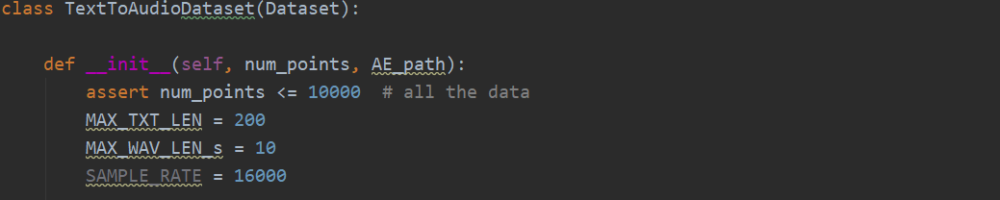

    

    
Since we know that the maximum audio is 10 seconds, we know that the maximum sequence
            length in the output will be 10 seconds / (0.1 seconds / encoded DFT) = 100 length encoded DFT sequence.
            Interestingly when we scan through all of the text, we find the longest text sequence to be ~200 characters
            long. In other words, we have compressed our audio sequence down to the point where its sequence length is
            half that of the text sequence length.

    

    
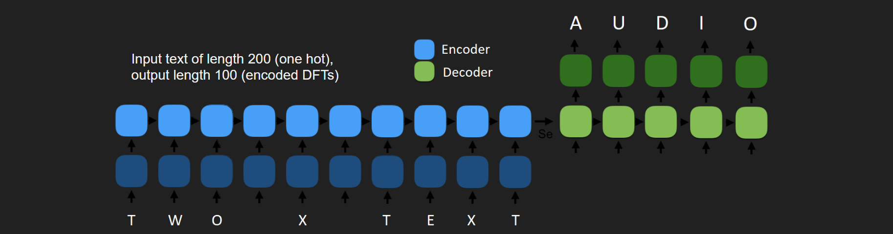

    

    
The Dataset object loads the audio data, passes it to the encoder block of the autoencoder, and
            then pairs the encoded audio with the text. Both the audio data and the text data are padded to equal length
            for each data point, with audio being 10 seconds, padded with zeros before being fed into the encoding
            block, and the text data being 200 characters, being padded with spaces before being one-hot encoded.
    

    

    
Text-to-speech RNN training

    
None of the models attempted had very much success. The model that was used for the
            final implementation was a 3 layer LSTM with 30 hidden dimensions. Although 10,000 datapoints were created,
            the model seemed to learn a little bit about the length of sequences better when using only 1,000 data
            points. A &nbsp;batch size of 20 was used for 3,000 epochs, taking about 6 hours. 

    

    <h2 class="c13" id="h.hx4t1vbbac5h">Results</h2>
    
The sequence to sequence model performed very poorly. The most that can be said is
            that it may have begun to learn a little about text length below is a small table comparing the results of a
            very short text sequence input and a very long text sequence input. The text and links to the audio are
            provided.

    

    

    <table class="c12">
        <tbody>
            <tr class="c6">
                <td class="c0" colspan="1" rowspan="1">
                    
Text input

                </td>
                <td class="c0" colspan="1" rowspan="1">
                    
RNN Output

                </td>
            </tr>
            <tr class="c6">
                <td class="c0" colspan="1" rowspan="1">
                    
test

                </td>
                <td class="c0" colspan="1" rowspan="1">
                    
<a class="c10"
                                href="https://www.google.com/url?q=https://drive.google.com/open?id%3D1COFpq7y2IHtSPVIBE_goXFwl4kb3rYJN&amp;sa=D&amp;ust=1583354762633000">seq2seq1.wav</a>
                    

                </td>
            </tr>
            <tr class="c6">
                <td class="c0" colspan="1" rowspan="1">
                    
this is a very long string of characters and it is not important
                            what it says

                </td>
                <td class="c0" colspan="1" rowspan="1">
                    
<a class="c10"
                                href="https://www.google.com/url?q=https://drive.google.com/open?id%3D1eK_hpBGBjmLWH_Pz7JQ3L56fX5Pc4X8k&amp;sa=D&amp;ust=1583354762635000">seq2seq3.wav</a>
                    

                </td>
            </tr>
        </tbody>
    </table>
    

    

    <h1 class="c7" id="h.uw8kqo3hcgay">Next Steps</h1>
    <h2 class="c13" id="h.p1c9vyy3bn92">Autoencoder</h2>
    
Several steps can be taken to improve the autoencoder. First, I need to understand
            more about activation functions and how stronger representations can be generated. The ReLU was chosen
            because of its immunity to vanishing gradient, but its simplicity may be hurting the performance of the
            model.

    

    
While I do believe the temporal compression of the sequence by to 100 ms per timestep
            is important for the sequence to sequence model, compressing the DFT from 3,200 down to 32 may not be. The
            data compression could be reduced, allowing for a more expressive, and therefore higher quality,
            representation of the input audio signal. The additional complexity may be able to be handled by the
            RNN.

    

    
Finally, I think that this encoder decoder model should be generative. A variational
            autoencoder could allow for a less rigid expression of the audio input, leading to a more natural sounding
            voice signal at the output.

    

    <h2 class="c13" id="h.mu9nlorsbmrb">Sequence to sequence RNN</h2>
    
I was very disappointed with the performance of the RNN. I think much of the failure
            here comes from my lack of understanding about how RNNs work. A deeper dive into the functionality of LSTMs
            is needed before proceeding with improving this portion of the model.

    

    
While the above is certainly the case, there is one observation that I made that is
            of interest. The output signal of the LSTM has almost no vocal characteristics in it. This is strange
            because even if we feed raw noise into the auto encoder, it will output signals with vocal characteristics.
        

    

    

    <table class="c12">
        <tbody>
            <tr class="c6">
                <td class="c0" colspan="1" rowspan="1">
                    
Noise input to autoencoder

                </td>
                <td class="c0" colspan="1" rowspan="1">
                    
Output of autoencoder

                </td>
            </tr>
            <tr class="c6">
                <td class="c0" colspan="1" rowspan="1">
                    
<a class="c10"
                                href="https://www.google.com/url?q=https://drive.google.com/open?id%3D1ctTFu1WSMvo8KupUmjfpqv0LzAgb9M_E&amp;sa=D&amp;ust=1583354762641000">https://drive.google.com/open?id=1ctTFu1WSMvo8KupUmjfpqv0LzAgb9M_E</a>
                    

                </td>
                <td class="c0" colspan="1" rowspan="1">
                    
<a class="c10"
                                href="https://www.google.com/url?q=https://drive.google.com/file/d/1lOb69jKF1Krsm0_u44uqje5DrMZfh9gF/view?usp%3Dsharing&amp;sa=D&amp;ust=1583354762642000">https://drive.google.com/file/d/1lOb69jKF1Krsm0_u44uqje5DrMZfh9gF/view?usp=sharing</a>
                    

                </td>
            </tr>
        </tbody>
    </table>
    

    
To me this implies that the encoder of the autoencoder is mapping to a very
            particular latent space that the LSTM may not be able to leverage. It is possible that simply adding batch
            normalization layers in the autoencoder would result in a more learnable representation at the output of the
            encoder layer that the LSTM could leverage. 

    

    
Finally, the loss function for this model was the MSE between the encoded DFT signal
            and the output of the LSTM. It is possible I would get improved performance if I were to write a custom loss
            function that compared the decompressed encoding and the decompressed output of the LSTM.

    

    <h1 class="c7" id="h.jwh4g9agl1vj">Implementation File Location</h1>
    

    

    <table class="c12">
        <tbody>
            <tr class="c6">
                <td class="c0" colspan="1" rowspan="1">
                    
Description

                </td>
                <td class="c0" colspan="1" rowspan="1">
                    
File Location

                </td>
            </tr>
            <tr class="c6">
                <td class="c0" colspan="1" rowspan="1">
                    
Autoencoder models (final model is AutoEncoder100 class)

                </td>
                <td class="c0" colspan="1" rowspan="1">
                    
./auto_encoder/models.py

                </td>
            </tr>
            <tr class="c6">
                <td class="c0" colspan="1" rowspan="1">
                    
Dataset objects for both autoencoder model (AutoEncoderDataSet) and
                            LSTM (TextToAudioDataset)

                </td>
                <td class="c0" colspan="1" rowspan="1">
                    
./data_utils/DatasetAE.py

                </td>
            </tr>
            <tr class="c6">
                <td class="c0" colspan="1" rowspan="1">
                    
Autoencoder training script

                </td>
                <td class="c0" colspan="1" rowspan="1">
                    
./data_utils/train_ae_relu_100ms.py

                </td>
            </tr>
            <tr class="c6">
                <td class="c0" colspan="1" rowspan="1">
                    
Autoencoder audio reconstruction test script

                </td>
                <td class="c0" colspan="1" rowspan="1">
                    
./scripts/test_rechunking.py

                </td>
            </tr>
            <tr class="c6">
                <td class="c0" colspan="1" rowspan="1">
                    
LSTM sequence to sequence model

                </td>
                <td class="c0" colspan="1" rowspan="1">
                    
./auto_encoder/seq2seq.py

                </td>
            </tr>
            <tr class="c6">
                <td class="c0" colspan="1" rowspan="1">
                    
LSTM training script

                </td>
                <td class="c0" colspan="1" rowspan="1">
                    
./data_utils/train_seq2seq.py

                </td>
            </tr>
            <tr class="c6">
                <td class="c0" colspan="1" rowspan="1">
                    
LSTM audio reconstruction test script

                </td>
                <td class="c0" colspan="1" rowspan="1">
                    
./scripts

                </td>
            </tr>
            <tr class="c6">
                <td class="c0" colspan="1" rowspan="1">
                    
Audio text pair generation script

                </td>
                <td class="c0" colspan="1" rowspan="1">
                    
./data_prep/clip_to_text.py

                </td>
            </tr>
            <tr class="c6">
                <td class="c0" colspan="1" rowspan="1">
                    
Audio processing and general utility functions

                </td>
                <td class="c0" colspan="1" rowspan="1">
                    
./utils.py

                </td>
            </tr>
        </tbody>
    </table>
    

</body>

</html>
